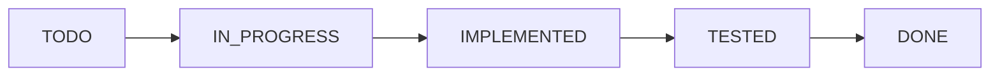

# DenHub — Development Process

> **Đây là quy trình phát triển BẮT BUỘC của DenHub.**  
> Mọi developer, Frontend Agent, Backend Agent và AI Coding Agent phải đọc file này trước khi thay đổi code.  
> **Không được bắt đầu implementation nếu chưa đọc các tài liệu liên quan trong `/docs`.**

---

## 1. MANDATORY READING BEFORE CODING

Trước khi thực hiện **BẤT KỲ** task nào, developer/agent phải đọc:

1. [`AGENTS.md`](../AGENTS.md)
2. [`00-DEVELOPMENT-PROCESS.md`](./00-DEVELOPMENT-PROCESS.md)
3. [`01-PROJECT-OVERVIEW.md`](./01-PROJECT-OVERVIEW.md)
4. [`02-SYSTEM-ARCHITECTURE.md`](./02-SYSTEM-ARCHITECTURE.md)
5. [`03-DATABASE-DESIGN.md`](./03-DATABASE-DESIGN.md)

Sau đó đọc code hiện tại liên quan trực tiếp tới task.

### Tuyệt đối KHÔNG được:
- Chỉ đọc prompt rồi code ngay.
- Chỉ đọc một file source code rồi tự suy đoán architecture toàn cục.
- Tự tạo endpoint mới ngoài contract.
- Tự tạo DTO contract hoặc tự thêm field tùy tiện.
- Tự tạo entity / field trong database.
- Tự tạo role / permission.
- Tự tạo enum / status.
- Tự tạo WebSocket destination.
- Tự thay đổi quan hệ database (relationships).

> [!WARNING]
> Nếu tài liệu chưa xác định một nghiệp vụ hoặc kỹ thuật:
> **Status: `TBD`**  
> Agent phải báo rằng contract chưa được chốt. **KHÔNG tự quyết định thay team.**

---

## 2. SOURCE OF TRUTH

Thứ tự ưu tiên và trách nhiệm của từng tài liệu trong `/docs`:

```
01-PROJECT-OVERVIEW.md      ───> WHAT / BUSINESS (Nghiệp vụ, khái niệm cốt lõi, phạm vi)
02-SYSTEM-ARCHITECTURE.md    ───> HOW / API / SECURITY / WEBSOCKET (Kiến trúc, contract giao tiếp)
03-DATABASE-DESIGN.md        ───> DATA / ENTITY / RELATIONSHIP / DATABASE (Schema, bảng, document)
00-DEVELOPMENT-PROCESS.md    ───> DEVELOPMENT RULES (Quy trình, checklist, tiến độ)
```

- **Không duplicate contract giữa các file.** Mỗi thông tin chỉ có một nơi duy nhất chịu trách nhiệm.
- **Nếu code và docs mâu thuẫn:**
  - **STOP.**
  - Không tự sửa docs theo code.
  - Không tự sửa code theo docs.
  - Phải ghi nhận conflict và yêu cầu team xác nhận.

---

## 3. BEFORE STARTING A TASK

Trước khi code, developer/agent phải xác định rõ các thông số:

```yaml
Task: [Tên task cụ thể]
Module: [Auth / Room / Member / Message / Real-time]
Related Business Rule: [Mục nào trong 01-PROJECT-OVERVIEW.md]
Related API: [Endpoint nào trong 02-SYSTEM-ARCHITECTURE.md]
Related Database: [Bảng SQL / Mongo collection trong 03-DATABASE-DESIGN.md]
Related WebSocket: [Destination nào trong 02-SYSTEM-ARCHITECTURE.md]
Affected Frontend: [Các component/page bị ảnh hưởng]
Affected Backend: [Các controller/service/repo bị ảnh hưởng]
Status: [TODO / IN_PROGRESS]
```

### Checklist bắt buộc trước khi code:
- [ ] Business Rule đã `CONFIRMED` chưa?
- [ ] API Contract đã `CONFIRMED` chưa?
- [ ] Database design đã `CONFIRMED` chưa?
- [ ] Permission đã `CONFIRMED` chưa?
- [ ] Có dependency với task khác không?

> [!CAUTION]
> Nếu task phụ thuộc vào một contract vẫn là `TBD`:  
> **KHÔNG tự implement theo phỏng đoán.** Dừng lại và yêu cầu team xác nhận trước.

---

## 4. IMPLEMENTATION RULE

Khi implement:
- **Chỉ thay đổi những file thực sự cần thiết cho task.**
- **Không được tự ý:**
  - Refactor các module không liên quan.
  - Rename API không liên quan.
  - Rename database field không liên quan.
  - Thay đổi response format chung.
  - Thay đổi cơ chế phân quyền (permission).
  - Thêm dependency không cần thiết vào `package.json` hoặc `build.gradle.kts`.
  - Thêm feature nằm ngoài phạm vi task được giao.
  - Tự ý mở rộng scope vì lý do *"Discord cũng có tính năng này"*.
- **Implementation phải tuân thủ nghiêm ngặt theo các tài liệu trong `/docs`.**

---

## 5. TASK STATUS

Mỗi task di chuyển qua vòng đời trạng thái:



| Trạng thái | Ý nghĩa |
| :--- | :--- |
| `TODO` | Chưa bắt đầu thực hiện. |
| `IN_PROGRESS` | Đang trong quá trình implement. |
| `IMPLEMENTED` | Đã code xong nhưng chưa xác nhận test hoàn chỉnh. |
| `TESTED` | Đã chạy toàn bộ các bài test bắt buộc và PASS 100%. |
| `DONE` | Code + test + docs liên quan đã đồng bộ hoàn toàn. |

---

## 6. DEFINITION OF DONE (DoD)

Một task **CHỈ ĐƯỢC PHÉP** chuyển sang trạng thái `DONE` khi thỏa mãn toàn bộ checklist:

- [ ] Implementation hoàn thành đầy đủ yêu cầu.
- [ ] Không còn compile error ở cả FE và BE.
- [ ] Không còn lỗi lint / build liên quan.
- [ ] Test liên quan đã được chạy thực tế.
- [ ] Test pass 100%.
- [ ] API contract vẫn đúng theo tài liệu.
- [ ] Database contract vẫn đúng theo tài liệu.
- [ ] Business Rules vẫn đúng theo tài liệu.
- [ ] FE/BE contract đồng bộ, không bị lệch trường dữ liệu.
- [ ] Docs liên quan đã được cập nhật (`01`, `02`, `03` nếu bị ảnh hưởng).
- [ ] Không còn code debug tạm (`console.log`, `System.out.println` rác, commented-out code).
- [ ] Không chứa secret / password / token nhạy cảm trong code.
- [ ] Git diff đã được review kỹ lưỡng (`git diff`, `git status`).
- [ ] Task status đã được cập nhật trong [Section 10](#10-current-project-progress) và [Section 11](#11-completed-work-log).

> [!WARNING]
> Nếu thiếu bất kỳ mục bắt buộc nào ở trên: **Task KHÔNG được đánh dấu DONE.**

---

## 7. TEST BEFORE COMMIT

> **TEST LÀ BẮT BUỘC TRƯỚC KHI COMMIT.**  
> Tuyệt đối không làm theo chu trình: `CODE → COMMIT → TEST SAU`.  
> Phải tuân theo chu trình:  
> `CODE → TEST → FIX → TEST LẠI → UPDATE DOCS → REVIEW DIFF → COMMIT`

### 7.1 Frontend
Trước khi commit Frontend phải tối thiểu:
1. Kiểm tra dependency hợp lệ.
2. Build project Frontend:
   ```bash
   npm run build
   ```
3. Kiểm tra route/page liên quan.
4. Kiểm tra lỗi console trình duyệt liên quan.
5. Test chức năng vừa thay đổi.
6. Nếu project có lint: `npm run lint`.
7. Nếu project có automated test: `npm test`.

*(Tuyệt đối không được ghi "TESTED" nếu command chưa thực sự được chạy).*

### 7.2 Backend
Trước khi commit Backend phải chạy test project:
- **Gradle (Project hiện tại):**
  ```bash
  # Linux / macOS
  ./gradlew test
  
  # Windows PowerShell / CMD
  .\gradlew.bat test
  ```
- Hoặc lệnh build/verify toàn diện:
  ```bash
  .\gradlew.bat check
  ```
*(Trường hợp sử dụng Maven: `./mvnw test` hoặc `mvnw.cmd test`).*

Phải kiểm tra:
- Compile không lỗi.
- Unit test pass.
- Service test pass.
- Repository test nếu liên quan pass.
- Controller / MockMvc test nếu liên quan pass.
- Security test nếu liên quan pass.
- Validation / error handling test nếu liên quan pass.

*(Không được đánh dấu TESTED nếu có bất kỳ test nào fail).*

### 7.3 API Integration
Nếu task ảnh hưởng cả FE ↔ BE, phải kiểm tra toàn chuỗi:

$$\text{Frontend Request} \longrightarrow \text{Backend Endpoint} \longrightarrow \text{Request DTO} \longrightarrow \text{Service} \longrightarrow \text{Database} \longrightarrow \text{Response DTO} \longrightarrow \text{Frontend}$$

Phải xác nhận:
- Endpoint URL chính xác tuyệt đối.
- HTTP method giống nhau.
- Field name khớp chuẩn (cả camelCase / snake_case).
- Kiểu dữ liệu (Datatype) tương thích hoàn toàn.
- Response format đúng chuẩn Envelope.
- Error format trả về đúng mã và cấu trúc lỗi.
- Authorization headers truyền đúng cách.

### 7.4 WebSocket
Nếu task ảnh hưởng WebSocket / STOMP, phải kiểm tra:
- `CONNECT`: Handshake và xác thực token thành công.
- `SEND`: Gửi payload lên đúng Destination prefix.
- `SUBSCRIBE`: Nhận message đúng Topic.
- `PAYLOAD`: Cấu trúc JSON gửi và nhận khớp contract.
- `AUTHENTICATION`: Bị từ chối nếu thiếu token hoặc token sai.
- `ERROR`: Xử lý khi có lỗi xảy ra.
- `RECONNECT`: Xử lý khi mất kết nối (nếu có).

FE và BE bắt buộc phải dùng cùng destination và payload format.

---

## 8. TEST FAILURE RULE

Nếu test fail:
**KHÔNG ĐƯỢC COMMIT / PUSH NHƯ MỘT TASK HOÀN CHỈNH.**

Phải thực hiện theo các bước:
1. Xác định chính xác test nào bị fail.
2. Tìm ra nguyên nhân gốc rễ (Root Cause).
3. Fix lỗi nếu thuộc phạm vi của task hiện tại.
4. Chạy lại test suite để kiểm tra ảnh hưởng phụ (regression).
5. Chỉ chuyển trạng thái `TESTED` khi tất cả bài test đã PASS.

> [!NOTE]
> **Xử lý lỗi tồn tại từ trước (Pre-existing issue):**  
> Nếu lỗi tồn tại từ trước và không thuộc phạm vi task:  
> - Không tự ý sửa nếu có nguy cơ ảnh hưởng sang module khác.  
> - Bắt buộc ghi nhận rõ ràng:  
>   `PRE-EXISTING ISSUE: [Mô tả chi tiết lỗi và file liên quan]`  
> - **Tuyệt đối không được giả vờ test pass.**

---

## 9. DOCUMENTATION UPDATE AFTER TASK

Sau khi hoàn thành code, **BẮT BUỘC** kiểm tra xem tài liệu trong `/docs` có cần cập nhật không:

- Thay đổi **Business / Feature / Rule**  
  $\longrightarrow$ Cập nhật [`01-PROJECT-OVERVIEW.md`](./01-PROJECT-OVERVIEW.md)
- Thay đổi **Architecture / API / DTO / Security / WebSocket**  
  $\longrightarrow$ Cập nhật [`02-SYSTEM-ARCHITECTURE.md`](./02-SYSTEM-ARCHITECTURE.md)
- Thay đổi **Entity / Field / Relationship / Constraint / Index / Enum**  
  $\longrightarrow$ Cập nhật [`03-DATABASE-DESIGN.md`](./03-DATABASE-DESIGN.md)

*Không phải task nào cũng sửa cả 3 file, chỉ cập nhật file thực sự bị ảnh hưởng. Nhưng BẮT BUỘC phải kiểm tra cả 3 trước khi đánh dấu DONE.*

---

## 10. CURRENT PROJECT PROGRESS

Bảng này phản ánh chính xác trạng thái thực tế của code trong dự án.  
*(Không đánh dấu DONE chỉ vì đã tạo file rỗng hay class chưa hoàn chỉnh).*

| Module | FE | BE | DB | Integration | Test | Status | Last Update |
| :--- | :---: | :---: | :---: | :---: | :---: | :---: | :---: |
| **Authentication** | TBD | TBD | TBD | TBD | TBD | TODO | 2026-10-06 |
| **Server/Room** | IN_PROGRESS | IN_PROGRESS | TBD | IN_PROGRESS | IN_PROGRESS | IN_PROGRESS | 2026-10-09 |
| **Channel** | TODO | IMPLEMENTED | CONFIRMED | IN_PROGRESS | IMPLEMENTED | IN_PROGRESS | 2026-10-10 |
| **Member** | TBD | TBD | TBD | TBD | TBD | TODO | 2026-10-06 |
| **Message** | TBD | TBD | TBD | TBD | TBD | TODO | 2026-10-06 |
| **Real-time** | TBD | TBD | TBD | TBD | TBD | TODO | 2026-10-06 |

*(Chỉ cập nhật trạng thái khi tính năng đã qua kiểm thử thực tế).*

---

## 11. COMPLETED WORK LOG

Nhật ký công việc đã hoàn thành. Mỗi task khi đạt chuẩn `DONE` sẽ được bổ sung một entry ngắn gọn theo template dưới đây:

### [2026-10-10] NV-1.10-FEAT-CHANNEL-CREATE — Làm API tạo Channel + Test (Kỳ Anh)
Implemented:
- Viết API `POST /api/v1/channels` cho phép tạo Channel mới trực thuộc Server.
- Kiểm tra tính hợp lệ dữ liệu: `name` (2 - 20 ký tự, không trống), `serverId` bắt buộc.
- Kiểm tra quyền: Người tạo phải là Server Owner hoặc là Member trong Server (`existsByServerIdAndUserId`).
- Chống trùng tên Channel trong cùng một Server (`existsByServerIdAndName`).
- Tự động sinh `position` theo số lượng channel hiện có trong server (`countByServerId`).
- Thêm tài liệu Swagger `@Operation`, `@Tag(name = "Channel")`, `@SecurityRequirement(name = "bearerAuth")`.

Frontend:
- Chưa thay đổi (chờ NV 1.15).

Backend:
- `ChannelRepository.java` (Created).
- `ServerMemberRepository.java` (Updated `existsByServerIdAndUserId`).
- `CreateChannelDTO.java`, `ChannelResponseDTO.java` (Created).
- `ChannelService.java` (Created).
- `ChannelResource.java` (Created).

Database:
- Đã ánh xạ thành công tới bảng `channels` với unique constraint `(name, server_id)`.

Tests:
- `ChannelServiceTest`: 6 unit tests pass 100%.
- `ChannelResourceTest`: 3 MockMvc tests pass 100%.
- Toàn bộ backend test suite (20/20 tests): PASS 100%.

Docs Updated:
- `docs/00-DEVELOPMENT-PROCESS.md` (Updated).
- `docs/02-SYSTEM-ARCHITECTURE.md` (Updated).

Commit:
- PENDING (Chờ người dùng ủy quyền).

---

### [2026-10-09] FEAT-SERVER-CREATE — API Tạo Server và Redesign UI
Implemented:
- Viết API `POST /api/v1/servers` cho phép tạo Server mới.
- Tự động thêm owner vào bảng `server_member` khi tạo server.
- Redesign `LoginPage.jsx` theo phong cách tech/dark/glassmorphism.
- Redesign `MainLayout.jsx` mô phỏng Discord (Sidebar trái cho Server List, Sidebar phụ cho Navigation).
- Tạo `CreateServerModal.jsx` với giao diện hiện đại để tương tác API tạo Server.
- Redesign `HomePage.jsx` loại bỏ tính năng Meeting rườm rà, tập trung vào giao diện gọn gàng.

Frontend:
- `LoginPage.jsx`, `MainLayout.jsx`, `HomePage.jsx`, `App.jsx`, `CreateServerModal.jsx`, `serverApi.js`.

Backend:
- `ServerResource.java`, `ServerService.java`, `CreateServerDTO.java`, `ServerResponseDTO.java`, Unit Tests.

Database:
- Không thay đổi bảng cấu trúc, tận dụng `owner_id` trong `Server` và bảng mapping `ServerMember`.

Tests:
- `.\gradlew.bat test`: PASS (2/2 tests cho service và resource pass).
- `npm run build`: PASS.

Docs Updated:
- `docs/02-SYSTEM-ARCHITECTURE.md` (Update API `/api/v1/servers` sang `CONFIRMED`).
- `docs/00-DEVELOPMENT-PROCESS.md` (Updated tiến độ).

Commit:
- PENDING
```

---

### [2026-10-06] CONFIG-ENV-FILE — Tách cấu hình nhạy cảm sang biến môi trường .env
Implemented:
- Tạo file `server/.env` cục bộ cho môi trường local (chứa DB credentials, JWT secret, server port, client url).
- Tạo template mẫu `server/.env.example` không chứa mật khẩu nhạy cảm để chia sẻ trong repository.
- Cập nhật `server/.gitignore` đảm bảo bỏ qua `.env` và theo dõi `.env.example`.
- Cập nhật `application.properties` và `application.properties.example` sử dụng cú pháp `${ENV_VAR:fallback}` để tự động nạp từ biến môi trường hoặc fallback về giá trị mặc định.

Backend:
- `server/.env`, `server/.env.example`, `server/.gitignore`, `server/src/main/resources/application.properties`, `server/src/main/resources/application.properties.example`.

Tests:
- `.\gradlew.bat test`: PASS (1/1 test passed)

Docs Updated:
- `docs/00-DEVELOPMENT-PROCESS.md` (Updated)

Commit:
- PENDING

---

### [2026-10-06] REFACTOR-PROPERTIES-PREFIX — Đổi đồng bộ tiền tố cấu hình djnd sang denhub
Implemented:
- Thay thế toàn bộ tiền tố `djnd.*` thành `denhub.*` (`denhub.app.name`, `denhub.jwt.*`, `denhub.client.*`).
- Cập nhật các file cấu hình: `application.properties`, `application.properties.example`, `server/src/test/resources/application.properties`.
- Cập nhật 5 file Java (`ExceptionTranslator.java`, `AccountResource.java`, `MailService.java`, `SecurityUtils.java`, `SecurityConfiguration.java`).
- Dọn dẹp ghi chú trong `server/HELP.md`.

Backend:
- Các file cấu hình properties và 5 file source Java bảo mật/mail/rest.

Tests:
- `.\gradlew.bat test`: PASS (1/1 test passed)

Docs Updated:
- `docs/00-DEVELOPMENT-PROCESS.md` (Updated)

Commit:
- PENDING

---

### [2026-10-06] CONFIG-DATASOURCE — Cập nhật cấu hình DataSource sang Microsoft SQL Server
Implemented:
- Cập nhật cấu hình datasource trong `server/src/main/resources/application.properties` từ H2 sang Microsoft SQL Server.
- Cấu hình driver `com.microsoft.sqlserver.jdbc.SQLServerDriver`, dialect `org.hibernate.dialect.SQLServerDialect`.
- Cấu hình kết nối tới SQL Server local (`localhost:1433`, database `denhubdb`, user `sa`).
- Đồng bộ mật khẩu `sa` (`123456`) trên SQL Server cục bộ và xác thực đăng nhập thành công.
- Tắt H2 console (`spring.h2.console.enabled=false`).
- Cập nhật template mẫu trong `server/src/main/resources/application.properties.example`.
- Giữ nguyên cấu hình H2 in-memory độc lập cho test suite trong `server/src/test/resources/application.properties`.

Backend:
- `server/src/main/resources/application.properties`

Tests:
- `.\gradlew.bat test`: PASS (1/1 test passed)

Docs Updated:
- `docs/00-DEVELOPMENT-PROCESS.md` (Updated)

Commit:
- PENDING

---

### [2026-10-06] REFACTOR-BACKEND — Đổi tên thư mục backend thành server và refactor package com.denhub
Implemented:
- Đổi tên thư mục backend từ `den-app-java-spring/` thành `server/`.
- Refactor toàn bộ package từ `tech.djnd.sample.app` sang `com.denhub`.
- Đổi tên Application class thành `DenHubApplication.java` và test class thành `DenHubApplicationTests.java`.
- Cập nhật `settings.gradle.kts` (`denhub-server`) và `build.gradle.kts` (`group = "com.denhub"`).
- Thêm cấu hình test `application.properties` (H2 in-memory) và `application.properties.example`.

Frontend:
- Chạy kiểm tra `npm run build` thành công, không có lỗi xung đột.

Backend:
- Toàn bộ 58 file Java đã cập nhật package sang `com.denhub`.

Database:
- Không thay đổi schema.

Tests:
- `.\gradlew.bat clean compileJava --no-daemon`: PASS
- `.\gradlew.bat test --no-daemon`: PASS (1/1 test passed)
- `npm run build`: PASS

Docs Updated:
- `docs/00-DEVELOPMENT-PROCESS.md` (Updated)

Commit:
- PENDING

---

### [2026-10-06] DOCS-INIT — Khởi tạo hệ thống tài liệu chuẩn DenHub
Implemented:
- Khởi tạo bộ 4 tài liệu cốt lõi làm Source of Truth cho toàn bộ dự án.

Frontend:
- Chưa thay đổi code.

Backend:
- Chưa thay đổi code.

Database:
- Chưa chạy migration.

Tests:
- File linting & Markdown validation: PASS

Docs Updated:
- `docs/00-DEVELOPMENT-PROCESS.md` (Created)
- `docs/01-PROJECT-OVERVIEW.md` (Created)
- `docs/02-SYSTEM-ARCHITECTURE.md` (Created)
- `docs/03-DATABASE-DESIGN.md` (Created)

Commit:
- PENDING

---

### [2026-10-10] FE-CYBERTECH-REDESIGN — Tái thiết kế toàn diện Frontend Cyber-Tech
Implemented:
- Tái cấu trúc Design System Frontend theo phong cách công nghệ cao cấp (DenHub Cyber-Modern Dark Theme).
- Cập nhật `App.jsx`, `index.css`, `AuthLayout.jsx` với các biến CSS Cyber, hiệu ứng Frosted Glassmorphism, Neon Glow và bảng màu Obsidian/Electric Indigo & Cyan.
- Tái thiết kế `LoginPage.jsx` và `RegisterPage.jsx`: Thêm biểu tượng Cyber phát sáng, card kính mờ, nút tiện ích 1-click Demo Fill (User / Admin) cho người dùng/giảng viên test nhanh.
- Tái thiết kế `MainLayout.jsx`: Thanh Dock launcher server bên trái với thanh chỉ báo Active Glow Pill, thanh trạng thái kết nối mạng thời gian thực, điều hướng phân cấp trực quan và thanh điều khiển người dùng.
- Tái thiết kế `HomePage.jsx` thành Trung Tâm Điều Khiển Số (Digital Command Hub): Banner chào đón công nghệ, các card thao tác nhanh 1 chạm cho người không chuyên, lưới danh sách server đã tham gia và widget thông số mạng STOMP/JWT.
- Nâng cấp `CreateServerModal.jsx`: Tinh giản bố cục theo chuẩn Discord hiện đại — loại bỏ hoàn toàn ô nhập URL thô rườm rà, loại bỏ chữ mô tả chìm trong các thẻ mẫu để chuyển thành 4 nút chip gọn gàng (Tự tạo, Học tập, Lập trình, Giải trí). Thiết kế 1 khu vực tải avatar duy nhất trực quan ở chính giữa kèm dãy ảnh gợi ý nhỏ gọn.
- Tích hợp tính năng tải file ảnh trực tiếp từ máy tính trong `CreateServerModal`: Hỗ trợ mở hộp thoại duyệt file, đọc Base64 và xem trước tức thì.
- Nâng cấp `icon_url` trong Backend (`Server.java`, `CreateServerDTO.java`) sang `NVARCHAR(MAX)` để lưu trọn vẹn dữ liệu ảnh tải từ máy.
- Tinh giản giao diện toàn diện: Loại bỏ các badge rườm rà, tạm ẩn các mục menu chưa có API (Rooms, Notifications, Admin) trong `MainLayout`, và tối giản hóa `LoginPage`, `HomePage`.
- Fix Authentication Redirect Loop: Xử lý bóc tách chuẩn envelope `RestResponse` (`res.data?.data`), chống lưu `undefined` token, sửa endpoint `/api/login` và chặn 401 redirect loop. Đã kiểm thử trực tiếp login và tạo server thành công 100%.

Frontend:
- `npm run build`: PASS 100% (vite v8.3.3 building client environment for production, 3174 modules transformed, 0 errors).

Backend:
- Giữ nguyên backend đã hoàn thiện ở bước trước (`ServerResource`, `ServerService`, `CreateServerDTO`, `ServerResponseDTO`).

Tests:
- `.\gradlew.bat test`: PASS 100% (5 actionable tasks, 0 failures, BUILD SUCCESSFUL).
- `npm run build`: PASS 100%.

Docs Updated:
- `docs/00-DEVELOPMENT-PROCESS.md` (Updated)

Commit:
- PENDING (Chờ người dùng ủy quyền)

### [2026-10-10] BE-FE-FILE-UPLOAD — API Upload File Cho Server Icon & Bảo Vệ Cấu Trúc Database
Implemented:
- Xây dựng hệ thống quản lý và upload file ảnh chuẩn RESTful ở Backend:
  - Thêm `FileUploadResponseDTO` (`fileName`, `url`, `size`, `contentType`).
  - Thêm `FileService`: Kiểm tra kích thước file (tối đa 5MB), định dạng file (chỉ cho phép jpg, jpeg, png, webp, gif), tự động tạo thư mục lưu trữ `uploads/{folder}/`, sinh tên file ngẫu nhiên chống trùng lặp bằng UUID và ngăn chặn tấn công Path Traversal.
  - Thêm `FileResource`: Cung cấp endpoint `POST /api/v1/files/upload` (nhận `MultipartFile` và trả về URL ảnh ngắn) và `GET /api/v1/files/{folder}/{filename}` (phục vụ file ảnh công khai cho trình duyệt với cache-control và đúng MediaType).
- Bảo vệ cấu trúc Database:
  - Khôi phục `@Column(name = "icon_url", length = 255)` trong `Server.java` và `@Size(max = 255)` trong `CreateServerDTO.java`.
  - Database SQL Server giữ nguyên cột `icon_url VARCHAR(255)`, không cần chạy DDL `ALTER TABLE` và không lưu chuỗi Base64 cồng kềnh vào database.
- Tích hợp Frontend:
  - Tạo mới `client/src/api/fileApi.js` hỗ trợ upload multipart/form-data.
  - Cập nhật `CreateServerModal.jsx`: Khi chọn file ảnh từ máy tính, hiển thị spinner tải và gọi `fileApi.upload(file)`, nhận URL ảnh ngắn hạn và gán vào `iconUrl` của form tạo server.
- Kiểm thử:
  - Thêm unit test `FileServiceTest` (3 tests: upload thành công, từ chối file rỗng, từ chối định dạng file lạ).
  - Thêm controller test `FileResourceTest` (upload multipart thành công trả về 201 Created và URL).
  - `.\gradlew.bat test`: PASS 100% (BUILD SUCCESSFUL).
### [2026-10-10] BE-FE-SERVER-SYNC — Đồng Bộ Danh Sách Server & Khắc Phục Lỗi Cache Ảnh Modal
Implemented:
- Backend:
  - Bổ sung query `findAllByUserIdOrOwnerId(Long userId)` trong `ServerRepository.java` để truy vấn danh sách server người dùng sở hữu hoặc là thành viên.
  - Thêm phương thức `getUserServers()` trong `ServerService.java` trả về `List<ServerResponseDTO>`.
  - Cung cấp endpoint `GET /api/v1/servers` trong `ServerResource.java`.
  - Bổ sung unit tests cho `getUserServers` trong `ServerServiceTest` và `ServerResourceTest`.
- Frontend:
  - Đồng bộ danh sách Server (Single Source of Truth): Quản lý toàn bộ danh sách `servers` tập trung tại `MainLayout.jsx` và truyền xuống `HomePage.jsx` qua `Outlet context`. Loại bỏ state `servers` riêng lẻ và xóa component `CreateServerModal` trùng lặp trong `HomePage.jsx`.
  - Giờ đây mọi hành động tạo server (từ nút `+` trên Dock launcher bên trái hay nút tạo trên HomePage) đều chia sẻ chung một modal và cập nhật đồng thời cả 2 vị trí (chấm tròn bên trái và thẻ ở giữa).
  - Tự động lấy danh sách server từ database khi tải trang qua `serverApi.getAll()`.
  - Khắc phục lỗi lưu ảnh upload làm mặc định: Bổ sung `destroyOnClose={true}` và hook `useEffect` trong `CreateServerModal.jsx` tự động reset toàn bộ form, dọn dẹp file input và khôi phục ảnh đại diện về preset mặc định (`AVATAR_SUGGESTIONS[0]`) mỗi khi mở lại modal.
- Kiểm thử:
  - `.\gradlew.bat test`: PASS 100% (BUILD SUCCESSFUL).
  - `npm run build`: PASS 100% (0 errors).

---

### [2026-10-10] BE-DOCS-SWAGGER — Cấu hình Swagger/OpenAPI 3 cho Backend
Implemented:
- Cấu hình thư viện `springdoc-openapi-starter-webmvc-ui` (v2.6.0) cho dự án Spring Boot 3.
- Tạo `SwaggerConfig.java` để khai báo metadata (Title, Description, Version) và cấu hình Security Scheme (JWT Bearer Auth).
- Cập nhật `SecurityConfiguration.java` đưa các endpoint `/v3/api-docs/**`, `/swagger-ui/**`, `/swagger-ui.html` vào `whiteList` và `publicEndpoints` để truy cập Swagger UI không bị chặn lỗi 401.
- Bổ sung Swagger annotations (`@Tag`, `@Operation`, `@SecurityRequirement`) cho các controllers hiện tại: `AccountResource`, `ServerResource`, `FileResource` để sinh tài liệu tự động, phản ánh đúng DTO/HTTP methods.
- Viết tài liệu hướng dẫn cho nhóm cách truy cập và sử dụng Swagger UI kèm JWT Auth tại `docs/guide/SWAGGER-GUIDE.md`.

Backend:
- Bổ sung dependency vào `server/build.gradle.kts`.
- `SwaggerConfig.java`, `SecurityConfiguration.java`.
- `AccountResource.java`, `ServerResource.java`, `FileResource.java`.

Tests:
- `.\gradlew.bat test`: PASS 100%.
- Kiểm tra OpenAPI schema JSON thành công.

Docs Updated:
- `docs/guide/SWAGGER-GUIDE.md` (Created).
- `docs/00-DEVELOPMENT-PROCESS.md` (Updated tiến độ).

Commit:
- PENDING (Chờ ủy quyền commit).

---

## 12. CURRENT WORK / HANDOFF

Phần này dùng để bàn giao giữa các Developer và AI Coding Agent khi chuyển ca hoặc dừng giữa task:

```yaml
Current Task: Cấu hình và tài liệu hóa Swagger/OpenAPI cho Backend
Status: IMPLEMENTED & VERIFIED
Completed:
  - Thêm dependency `springdoc-openapi`
  - Viết file cấu hình Swagger
  - Annotate các controllers hiện có (Account, Server, File)
  - Mở whitelist các đường dẫn Swagger trong Spring Security
  - Chạy backend test: PASS
  - Viết file hướng dẫn sử dụng nhóm
Remaining:
  - Chờ user duyệt git diff và ủy quyền tạo commit
Known Issues:
  - Không có
Next Recommended Step:
  - Trình bày kết quả trực quan cho User, hỏi quyền commit
Files Being Changed:
  - server/build.gradle.kts
  - server/src/main/java/com/denhub/config/SwaggerConfig.java
  - server/src/main/java/com/denhub/config/SecurityConfiguration.java
  - server/src/main/java/com/denhub/web/rest/AccountResource.java
  - server/src/main/java/com/denhub/web/rest/ServerResource.java
  - server/src/main/java/com/denhub/web/rest/FileResource.java
  - docs/guide/SWAGGER-GUIDE.md
  - docs/00-DEVELOPMENT-PROCESS.md
Related Docs:
  - AGENTS.md
  - docs/00-DEVELOPMENT-PROCESS.md
  - docs/02-SYSTEM-ARCHITECTURE.md
```

---

## 13. GIT DIFF REVIEW

Trước khi tạo commit, **BẮT BUỘC** chạy và review:

```bash
git status
git diff
# Nếu đã git add:
git diff --staged
```

### Danh mục kiểm tra:
- File nào thực sự bị thay đổi? Có file nào ngoài phạm vi task bị sửa nhầm không?
- Có để sót code debug tạm thời không (`console.log`, `debugger`, comment rác)?
- Có vô tình commit bí mật không (API keys, secret tokens, mật khẩu, file `.env`)?
- Có file rác do build sinh ra không (`.class`, `dist/`, `.log`, `.DS_Store`)?
- Có thay đổi contract API/DB ngoài ý muốn không?

---

## 14. COMMIT RULE

Mỗi commit **CHỈ ĐƯỢC CHỨA MỘT LOGICAL CHANGE DUY NHẤT.**  
Không gom nhiều task hoặc các thay đổi không liên quan vào một commit lớn.

### Quy chuẩn đặt tên commit (Conventional Commits):

#### ✅ GOOD:
- `feat(auth): implement login API`
- `feat(room): add room creation`
- `feat(message): add realtime message delivery`
- `test(room): add room service tests`
- `docs(api): document room API contract`
- `fix(auth): handle expired JWT`

#### ❌ BAD (Tuyệt đối tránh):
- `update code`
- `fix`
- `final`
- `done`
- `project update`
- `everything works`

---

## 15. PUSH RULE

Trước khi chạy `git push`, phải kiểm tra đủ các điều kiện:

- [ ] Đã đọc các tài liệu liên quan trong `/docs`.
- [ ] Task đã hoàn thành trọn vẹn theo yêu cầu.
- [ ] Toàn bộ automated tests đã PASS.
- [ ] Dự án build thành công không lỗi (`npm run build`, `.\gradlew.bat check`).
- [ ] Các tài liệu `/docs` liên quan đã được đồng bộ.
- [ ] Section `Current Project Progress` đã được cập nhật.
- [ ] Git diff đã được review cẩn thận.
- [ ] Không có secret, credential hoặc file rác trong commit.
- [ ] Commit message rõ ràng, đúng chuẩn quy ước.

> [!CAUTION]
> **Nếu thiếu dù chỉ 1 mục: TUYỆT ĐỐI KHÔNG PUSH.**

---

## 16. AGENT STARTUP PROTOCOL

Mỗi AI Coding Agent khi nhận task **BẮT BUỘC** tuân thủ tuần tự 17 bước:

1. **STEP 1:** Đọc kỹ [`AGENTS.md`](../AGENTS.md) và [`00-DEVELOPMENT-PROCESS.md`](./00-DEVELOPMENT-PROCESS.md).
2. **STEP 2:** Đọc [`01-PROJECT-OVERVIEW.md`](./01-PROJECT-OVERVIEW.md) để nắm Business Context.
3. **STEP 3:** Đọc [`02-SYSTEM-ARCHITECTURE.md`](./02-SYSTEM-ARCHITECTURE.md) để nắm API & Architecture Contract.
4. **STEP 4:** Đọc [`03-DATABASE-DESIGN.md`](./03-DATABASE-DESIGN.md) để nắm Database Model.
5. **STEP 5:** Đọc mục [Current Project Progress](#10-current-project-progress), [Current Work / Handoff](#12-current-work--handoff) và [Completed Work Log](#11-completed-work-log).
6. **STEP 6:** Inspect toàn bộ mã nguồn liên quan trực tiếp đến task.
7. **STEP 7:** So sánh tài liệu `/docs` với implementation hiện tại của codebase.
8. **STEP 8:** Nếu phát hiện conflict $\longrightarrow$ **STOP NGAY LẬP TỨC** và báo cáo conflict cho team.
9. **STEP 9:** Nếu contract đã rõ ràng (`CONFIRMED`) $\longrightarrow$ Bắt đầu implement task.
10. **STEP 10:** Chạy automated tests liên quan.
11. **STEP 11:** Fix lỗi phát sinh và chạy lại test cho đến khi PASS 100%.
12. **STEP 12:** Cập nhật tài liệu `/docs` nếu có thay đổi liên quan.
13. **STEP 13:** Cập nhật bảng `Current Project Progress`.
14. **STEP 14:** Cập nhật `Completed Work Log` hoặc `Current Work / Handoff`.
15. **STEP 15:** Review kỹ lưỡng `git diff`.
16. **STEP 16:** Tạo commit với format chuẩn.
17. **STEP 17:** Chỉ push khi toàn bộ điều kiện push trong [Push Rule](#15-push-rule) đã đạt.

---

## 17. AGENT STOP CONDITIONS

Agent phải **STOP** và chủ động hỏi/xác nhận từ team nếu gặp các tình huống sau:

- Business Rule cần thiết cho task vẫn đang ở trạng thái `TBD`.
- API contract chưa được chốt (`TBD`).
- Database schema / relationship chưa được định nghĩa rõ ràng.
- Quyền hạn (Permission / Role) chưa được thống nhất.
- Các tài liệu trong `/docs` mâu thuẫn lẫn nhau.
- Tài liệu trong `/docs` mâu thuẫn với code hiện có.
- Contract phía Frontend và Backend không khớp nhau.
- Yêu cầu task có dấu hiệu mở rộng scope (Scope creep).
- Cần xóa hoặc thay đổi lớn cấu trúc dữ liệu đã có.
- Cần thay đổi kiến trúc lớn của hệ thống.
- Test bị fail mà nguyên nhân không thuộc task hoặc chưa xác định được rõ ràng.

*(Tuyệt đối không giải quyết bằng cách tự suy đoán).*

---

## 18. DOCUMENTATION IS PART OF THE CODE

Đối với dự án DenHub:
> **Chỉ viết code là CHƯA ĐỦ.**  
> Một thay đổi có ảnh hưởng đến contract nhưng không cập nhật tài liệu `/docs` được xem là **CHƯA HOÀN THÀNH.**

### Flow chuẩn:
```
READ DOCS
    ↓
UNDERSTAND CURRENT STATUS
    ↓
CHECK CONTRACT
    ↓
IMPLEMENT
    ↓
TEST
    ↓
FIX
    ↓
TEST AGAIN
    ↓
UPDATE DOCS
    ↓
UPDATE PROGRESS / HANDOFF
    ↓
REVIEW GIT DIFF
    ↓
COMMIT
    ↓
PUSH
```

---

## 19. FINAL CHECKLIST

Trước khi kết thúc bất kỳ phiên làm việc nào:

- [ ] Đã đọc `00-DEVELOPMENT-PROCESS.md`
- [ ] Đã đọc `01-PROJECT-OVERVIEW.md`
- [ ] Đã đọc `02-SYSTEM-ARCHITECTURE.md`
- [ ] Đã đọc `03-DATABASE-DESIGN.md`
- [ ] Đã hiểu rõ `Current Project Progress`
- [ ] Task không vi phạm bất kỳ contract nào
- [ ] Implementation đã hoàn thành
- [ ] Build pass
- [ ] Tests pass
- [ ] FE/BE contract đồng bộ hoàn toàn
- [ ] Docs liên quan đã được cập nhật
- [ ] Project Progress đã được cập nhật
- [ ] Work Log / Handoff đã được cập nhật
- [ ] Git diff đã được review
- [ ] Không có secret hoặc debug code
- [ ] Commit chỉ chứa logical change
- [ ] Đủ điều kiện và sẵn sàng push
