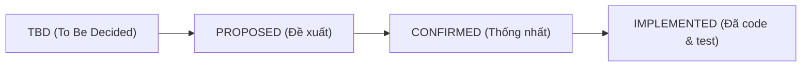
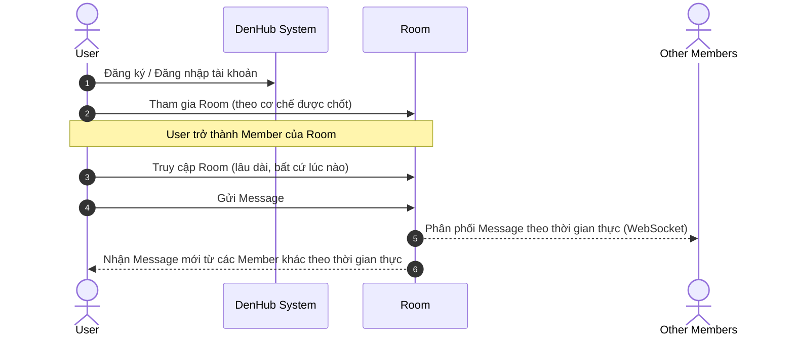

# 01 - PROJECT OVERVIEW: DENHUB

> **Tài liệu nền tảng & Khung nghiên cứu nghiệp vụ (Living Documentation + Research Template)**  
> **Source of Truth** cho toàn bộ thành viên nhóm, Frontend, Backend, Database và AI Coding Agents.

---

## 1. Thông tin chung về dự án

| Thuộc tính | Giá trị | Trạng thái |
| :--- | :--- | :--- |
| **Tên dự án** | **DenHub** | `CONFIRMED` |
| **Loại dự án** | Nền tảng giao tiếp và cộng tác theo nhóm trên web (Web-based Group Communication & Collaboration Platform) | `CONFIRMED` |
| **Khóa môn / Ngữ cảnh** | Môn học SBA301 | `CONFIRMED` |
| **Ý tưởng tổng quát** | DenHub là nền tảng giao tiếp theo nhóm, lấy cảm hứng từ một số khái niệm tổ chức và giao tiếp cộng đồng của Discord, nhưng có phạm vi nhỏ hơn và đơn giản hơn để phù hợp với thời gian, nguồn lực nhóm và yêu cầu học phần. | `CONFIRMED` |

---

## 2. Tuyên ngôn định vị: DenHub KHÔNG PHẢI BẢN SAO DISCORD

> [!IMPORTANT]
> **Nguyên tắc bất di bất dịch:**  
> Discord chỉ được sử dụng như **nguồn tham khảo** để hiểu một số khái niệm giao tiếp nhóm cơ bản.  
> **DenHub KHÔNG sao chép:**
> - Nghiệp vụ phức tạp của Discord
> - Toàn bộ UI/UX của Discord
> - Thiết kế Database của Discord
> - Cấu trúc API của Discord
> - Hệ thống phân quyền nhiều tầng (Permission Hierarchy/Role inheritance) của Discord
> - Toàn bộ hệ sinh thái tính năng của Discord
>
> **Không được tự suy luận rằng một chức năng tồn tại trong DenHub chỉ vì Discord có chức năng đó.**

### Danh sách tính năng TUYỆT ĐỐI KHÔNG THIẾT KẾ (Out of Scope)
Các tính năng sau **KHÔNG** nằm trong phạm vi DenHub hiện tại:
- ❌ **Meeting & Lịch họp:** Không thiết kế Meeting, Meeting Schedule, Meeting Participant, Meeting Start/End Time.
- ❌ **Giao tiếp âm thanh / hình ảnh:** Không có Voice Meeting, Video Meeting, Voice Call, Video Call, Screen Sharing.
- ❌ **Các tính năng phụ trợ phức tạp:** Không tự ý đưa vào Direct Message (DM), Friend System, Bot, Thread, Category, Server Boosting...
*(Nếu sau này muốn bổ sung bất kỳ tính năng nào ở trên thì bắt buộc phải thông qua quy trình xem xét thay đổi phạm vi của nhóm).*

---

## 3. Quy ước trạng thái tài liệu (Documentation Lifecycle)

Tài liệu này và các tài liệu kiến trúc liên quan được duy trì dưới dạng **Living Documentation**. Mọi mục nghiệp vụ và kỹ thuật sẽ chuyển dịch qua các trạng thái sau:



- `TBD (To Be Decided)`: Chưa nghiên cứu hoặc chưa có phương án rõ ràng. Tuyệt đối không tự suy diễn khi code.
- `PROPOSED`: Đã có member đề xuất giải pháp cụ thể nhưng team chưa chính thức chốt.
- `CONFIRMED`: Toàn team đã thảo luận, đồng thuận và trở thành **Contract chính thức** của dự án.
- `IMPLEMENTED`: Contract đã được hiện thực hóa đầy đủ trong source code và kiểm thử thành công.

---

## 4. Các khái niệm cốt lõi đã chốt (`CONFIRMED`)

Mô hình cấu trúc cốt lõi hiện tại của DenHub:

```
User ──(tham gia)──> Room ──(chứa)──> Members
                       └──(chứa)──> Messages (Real-time)
```

1. **User** (`CONFIRMED`):
   - Tài khoản người dùng định danh trong hệ thống DenHub.
   - Một User có thể tham gia nhiều Room khác nhau.

2. **Room** (`CONFIRMED`):
   - Không gian giao tiếp tồn tại lâu dài (persistent) của một nhóm.
   - User sau khi tham gia Room có thể truy cập lại Room bất cứ lúc nào nếu vẫn còn quyền tham gia.
   - **Room KHÔNG PHẢI cuộc họp, KHÔNG có thời gian bắt đầu hay kết thúc.**
   - Một Room có thể có nhiều Member.

3. **Member** (`CONFIRMED`):
   - Một User đã tham gia vào một Room cụ thể.
   - Membership thể hiện mối quan hệ giữa User và Room.
   - *Lưu ý:* Quyền hạn chi tiết của từng Member trong Room chưa được mặc định và cần được team nghiên cứu, chốt phương án.

4. **Message** (`CONFIRMED`):
   - Nội dung trao đổi bằng văn bản giữa các Member trong Room.
   - *Lưu ý:* Các chức năng mở rộng như edit, delete, reply, reaction... chưa được mặc định.

5. **Real-time Messaging** (`CONFIRMED`):
   - Tin nhắn mới trong Room được gửi và nhận theo thời gian thực giữa các thành viên đang hoạt động trong Room.

---

## 5. Luồng người dùng tổng quát ban đầu (`CONFIRMED`)



### Các nhu cầu chính của phiên bản MVP:
- Người dùng có tài khoản trong hệ thống.
- Người dùng có thể tham gia các Room.
- Người dùng đã tham gia Room trở thành Member của Room đó.
- Member có thể truy cập lại Room bất cứ lúc nào.
- Member có thể trao đổi Message trong Room.
- Message được cập nhật theo thời gian thực (Real-time).
- Room có cơ chế quản lý thành viên phù hợp.
- Hệ thống có Authentication và Authorization phù hợp.

---

## 6. Khung nghiên cứu nghiệp vụ cần làm rõ (Research Checklist)

Tất cả các mục dưới đây **chưa được chốt** và được đánh dấu `TBD`. Các thành viên khi nghiên cứu và đề xuất cần trả lời đủ **10 câu hỏi đánh giá phạm vi**:

> [!TIP]
> ### 10 Câu hỏi bắt buộc khi đề xuất tính năng mới:
> 1. Chức năng này giải quyết vấn đề gì cụ thể?
> 2. Đối tượng User nào cần chức năng này?
> 3. Chức năng có thực sự cần thiết cho MVP không? (Có thể hoãn sang v2 không?)
> 4. Business rule (quy tắc nghiệp vụ) cụ thể là gì?
> 5. Phía Frontend (FE) cần làm gì, giao diện ra sao?
> 6. Phía Backend (BE) cần xử lý logic gì?
> 7. Database cần lưu trữ những dữ liệu gì? (SQL Server hay MongoDB?)
> 8. Tương tác này sử dụng REST API hay WebSocket?
> 9. Chức năng có ảnh hưởng đến Security / Authentication / Authorization không?
> 10. Nhóm có đủ thời gian implement, viết unit test và bảo vệ (defense) trước hội đồng không?

---

## 7. Bảng theo dõi các nghiệp vụ chưa chốt (`TBD`)

| Phân hệ | Vấn đề cần nghiên cứu & thống nhất | Trạng thái | Thành viên phụ trách | Ghi chú / Phương án đề xuất |
| :--- | :--- | :---: | :---: | :--- |
| **ROOM** | Ai được tạo Room? (Mọi User hay Role đặc biệt?) | `TBD` | — | Cần đơn giản hóa cho MVP |
| **ROOM** | User tham gia Room bằng cách nào? (Tìm kiếm, Invite code/link, Admin add?) | `TBD` | — | Cần cơ chế dễ demo và test |
| **ROOM** | Room có phân loại Public / Private không? | `TBD` | — | Nếu không cần thiết, cân nhắc giữ một loại |
| **ROOM** | Có mã mời (Invite code) hoặc Invite link không? | `TBD` | — | — |
| **ROOM** | Ai có quyền xóa Room? (Creator / Admin?) | `TBD` | — | — |
| **ROOM** | Ai có quyền chỉnh sửa thông tin Room (Tên, mô tả, ảnh đại diện)? | `TBD` | — | — |
| **ROOM** | Quy trình User rời Room (Leave Room)? | `TBD` | — | — |
| **ROOM** | Điều gì xảy ra khi người tạo Room (Creator/Owner) rời Room? | `TBD` | — | Chuyển quyền hay giải tán Room? |
| **ROOM** | Room có những trạng thái vòng đời nào (ACTIVE, ARCHIVED...)? | `TBD` | — | — |
| **ROOM** | Có giới hạn số lượng Member trong một Room không? | `TBD` | — | — |
| **MEMBER** | Member có Role riêng trong từng Room hay không? (Owner, Admin, Member?) | `TBD` | — | Tránh làm phân quyền quá phức tạp |
| **MEMBER** | Ai được quyền mời Member mới? | `TBD` | — | — |
| **MEMBER** | Ai được quyền Kick (đuổi) Member? | `TBD` | — | — |
| **MEMBER** | Ai được quyền Ban (chặn vĩnh viễn) Member? | `TBD` | — | Có cần thiết cho MVP không? |
| **MEMBER** | Member có thể tự ý rời Room bất kỳ lúc nào không? | `TBD` | — | — |
| **MEMBER** | Ma trận quyền hạn cụ thể của từng loại Member là gì? | `TBD` | — | — |
| **MESSAGE** | Member nào được phép gửi Message? | `TBD` | — | — |
| **MESSAGE** | Có cho phép Edit Message không? | `TBD` | — | — |
| **MESSAGE** | Có cho phép Delete Message không? (Soft delete hay hard delete?) | `TBD` | — | — |
| **MESSAGE** | Có chức năng Reply (trả lời trích dẫn) không? | `TBD` | — | — |
| **MESSAGE** | Có chức năng Reaction (thả cảm xúc emoji) không? | `TBD` | — | — |
| **MESSAGE** | Có hỗ trợ Attachment / File / Image không? | `TBD` | — | Cân nhắc lưu trữ file và upload size |
| **MESSAGE** | Message có trạng thái nào (SENT, DELIVERED, EDITED, DELETED)? | `TBD` | — | — |
| **MESSAGE** | Cơ chế phân trang (Pagination) lịch sử tin nhắn (Cursor-based hay Page/Size)? | `TBD` | — | — |
| **CHANNEL** | Room có chia thành các Channel nhỏ hay không? | `TBD` | — | **Mặc định MVP: KHÔNG có Channel trừ khi chứng minh được sự cần thiết** |
| **NOTIFICATION** | MVP có cần Notification không? | `TBD` | — | **Mặc định MVP: Chưa bắt buộc** |
| **NOTIFICATION** | Nếu có, sự kiện nào kích hoạt Notification? Có cần real-time notification qua WS không? | `TBD` | — | — |
| **AUTH** | Quy trình Đăng ký tài khoản (Register) cần các trường nào? Có OTP/Email verify không? | `TBD` | — | Khuyên dùng: Đăng ký đơn giản cho MVP |
| **AUTH** | Cơ chế Đăng nhập (Login) và phát hành JWT Token? | `TBD` | — | — |
| **AUTH** | JWT Payload gồm những claims nào? Hạn sử dụng bao lâu? | `TBD` | — | — |
| **AUTH** | Có cần Refresh Token không hay Access Token thời gian vừa đủ? | `TBD` | — | — |
| **AUTH** | Cơ chế Đăng xuất (Logout) (Xóa token phía client hay duy trì Blacklist/Redis)? | `TBD` | — | — |
| **AUTH** | Chức năng Quên mật khẩu / Reset Password có thuộc MVP không? | `TBD` | — | — |
| **AUTHORIZATION** | Hệ thống có những System Role nào (ROLE_USER, ROLE_ADMIN...)? | `TBD` | — | — |
| **AUTHORIZATION** | Room Role và System Role phối hợp như thế nào? | `TBD` | — | — |
| **AUTHORIZATION** | Các layer kiểm tra quyền ở Backend (Spring Security Filter, `@PreAuthorize`, Service-level)? | `TBD` | — | — |

---

## 8. Nguyên tắc đồng bộ Frontend - Backend (Single Source of Truth)

1. **Không tự ý tạo contract riêng:**
   - Cả FE và BE không được tự định nghĩa API endpoint, DTO, WebSocket topic mà chưa cập nhật vào bộ tài liệu này (`02-SYSTEM-ARCHITECTURE.md` và `03-DATABASE-DESIGN.md`).
2. **Không bẻ cong contract vì sự tiện lợi tạm thời:**
   - Frontend không tự thêm các field ảo vào payload gửi lên backend nếu chưa thống nhất.
   - Backend không tự ý thay đổi tên trường JSON, kiểu dữ liệu hoặc cấu trúc response envelope mà không thông báo.
3. **Quy tắc xử lý bất đồng thuận (Conflict Resolution):**
   - Nếu phát hiện code thực tế và tài liệu mâu thuẫn: **DỪNG LẠI và KHÔNG tự ý chọn một bên.**
   - Người phát hiện phải tạo mục thảo luận trong nhóm để thống nhất sửa tài liệu hoặc sửa code.
