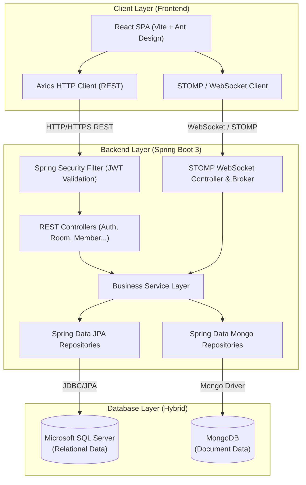
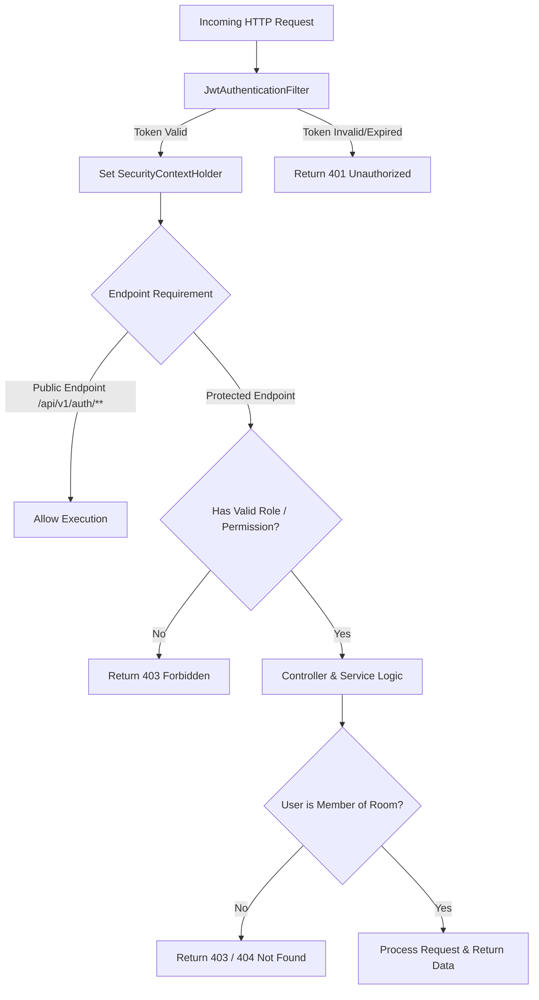

# 02 - SYSTEM ARCHITECTURE: DENHUB

> **Tài liệu kiến trúc hệ thống & Quy chuẩn giao tiếp (Living Documentation + Research Template)**  
> **Source of Truth** về Stack công nghệ, Kiến trúc tầng, REST API Contract, WebSocket Contract và Security.

---

## 1. Trạng thái & Định hướng kiến trúc

Tài liệu này xác lập ranh giới kỹ thuật và hợp đồng giao tiếp (Communication Contract) giữa Frontend và Backend.

> [!NOTE]
> Mọi thành phần công nghệ đã chọn ở mức định hướng (`CONFIRMED`) không có nghĩa là kiến trúc chi tiết đã tự động hoàn tất.  
> Các phương án triển khai chi tiết, endpoint, payload, destination được đánh dấu `TBD` hoặc `PROPOSED` cho đến khi team thống nhất.

---

## 2. Technology Stack đã chốt (`CONFIRMED`)

| Tầng / Phân hệ | Công nghệ lựa chọn | Mục đích sử dụng | Trạng thái |
| :--- | :--- | :--- | :---: |
| **Frontend Framework** | **React + Vite** | Xây dựng Single Page Application (SPA) hiệu năng cao | `CONFIRMED` |
| **Frontend Language** | **JavaScript / JSX** | Ngôn ngữ lập trình chính của client | `CONFIRMED` |
| **Routing** | **React Router DOM** | Điều hướng trang và bảo vệ các Private Routes | `CONFIRMED` |
| **UI Component Library** | **Ant Design (antd)** | Thư viện UI chuẩn mực cho form, layout, button, modal | `CONFIRMED` |
| **Pro UI Components** | **@ant-design/pro-components** | Thành phần nâng cao (ProLayout, ProTable, ProForm) | `CONFIRMED` |
| **HTTP Client** | **Axios** | Giao tiếp REST API, cấu hình Interceptor cho JWT | `CONFIRMED` |
| **Token Handling** | **jwt-decode** | Giải mã client-side JWT payload để lấy user info | `CONFIRMED` |
| **Text Utility** | **slugify** | Hỗ trợ chuẩn hóa chuỗi, tạo slug hoặc đường dẫn | `CONFIRMED` |
| **Real-time Client** | **STOMP / WebSocket (@stomp/stompjs)** | Kết nối WebSocket và xử lý STOMP protocol | `CONFIRMED` |
| **Backend Framework** | **Java + Spring Boot 3** | Xây dựng RESTful API và WebSocket server | `CONFIRMED` |
| **Security & Auth** | **Spring Security + JWT** | Xác thực người dùng, bảo vệ API và handshake WebSocket | `CONFIRMED` |
| **Relational ORM** | **Spring Data JPA (Hibernate)** | Tương tác với cơ sở dữ liệu quan hệ SQL Server | `CONFIRMED` |
| **Document ORM** | **Spring Data MongoDB** | Tương tác với cơ sở dữ liệu NoSQL MongoDB | `CONFIRMED` |
| **Real-time Server** | **Spring WebSocket + STOMP Messaging** | Quản lý STOMP broker, phân phối tin nhắn theo room | `CONFIRMED` |
| **API Documentation** | **OpenAPI 3 / Swagger (Springdoc)** | Tự động sinh tài liệu API và hỗ trợ test endpoint | `CONFIRMED` |
| **Relational Database** | **Microsoft SQL Server** | Lưu trữ dữ liệu cấu trúc quan hệ cốt lõi | `CONFIRMED` |
| **NoSQL Database** | **MongoDB** | Lưu trữ dữ liệu tài liệu linh hoạt/hiệu năng cao | `CONFIRMED` |
| **Backend Testing** | **JUnit 5 + Mockito + MockMvc** | Kiểm thử đơn vị (Unit Test) và kiểm thử API layer | `CONFIRMED` |

---

## 3. Kiến trúc tổng thể hệ thống (High-Level Architecture)



---

## 4. Phân chia ranh giới: REST API vs WebSocket

Nhằm giữ hệ thống đơn giản, dễ debug và bảo trì, dự án phân tách rõ ranh giới giao tiếp:

| Giao thức | Phạm vi áp dụng | Lý do thiết kế |
| :--- | :--- | :--- |
| **REST API (HTTP/HTTPS)** | - Authentication (Đăng ký, Đăng nhập)<br>- Quản lý Room (Tạo, Sửa, Xóa, Lấy danh sách)<br>- Quản lý Member (Tham gia, Rời, Kick, Phân quyền)<br>- Tải lịch sử tin nhắn (Message History, Phân trang) | Các tác vụ dạng Request-Response kinh điển, cần kiểm soát transaction, mã trạng thái HTTP chuẩn và dễ test qua MockMvc / Swagger. |
| **WebSocket (STOMP)** | - Gửi và nhận tin nhắn mới theo thời gian thực (Real-time Messages)<br>- Các sự kiện tức thời trong Room (ví dụ: member mới tham gia - `TBD`) | Cần độ trễ thấp (low latency), kênh kết nối hai chiều liên tục, không cần polling liên tục gây tải cho server. |

---

## 5. Quy chuẩn REST API Contract

### 5.1 Cấu trúc phản hồi thành công chuẩn (`PROPOSED`)
Mọi REST API nên trả về một cấu trúc Envelope đồng nhất:

```json
{
  "success": true,
  "code": 200,
  "message": "Thực hiện thành công",
  "data": { ... },
  "timestamp": "2026-10-06T10:15:30Z"
}
```

### 5.2 Cấu trúc phản hồi lỗi chuẩn (`PROPOSED`)
Khi có lỗi xảy ra (4xx, 5xx), Backend bắt buộc trả về format:

```json
{
  "success": false,
  "code": 400,
  "errorCode": "ROOM_NAME_DUPLICATE",
  "message": "Tên phòng đã tồn tại trong hệ thống",
  "errors": [
    {
      "field": "name",
      "rejectedValue": "Dev Room",
      "message": "Tên phòng không được trùng lặp"
    }
  ],
  "timestamp": "2026-10-06T10:15:30Z"
}
```

### 5.3 Cấu trúc phân trang danh sách chuẩn (`PROPOSED`)
```json
{
  "success": true,
  "code": 200,
  "data": {
    "items": [ ... ],
    "page": 0,
    "size": 20,
    "totalElements": 150,
    "totalPages": 8,
    "hasNext": true
  },
  "timestamp": "2026-10-06T10:15:30Z"
}
```

### 5.4 Danh mục REST API cần nghiên cứu chi tiết (`TBD`)

| Phân hệ | Phương thức | Endpoint | Chức năng dự kiến | Trạng thái |
| :--- | :---: | :--- | :--- | :---: |
| **Auth** | `POST` | `/api/v1/auth/register` | Đăng ký tài khoản mới | `TBD` |
| **Auth** | `POST` | `/api/v1/auth/login` | Đăng nhập và lấy Access Token JWT | `TBD` |
| **Auth** | `GET` | `/api/v1/auth/me` | Lấy thông tin user hiện tại qua token | `TBD` |
| **Auth** | `POST` | `/api/v1/auth/logout` | Đăng xuất người dùng | `TBD` |
| **Room** | `GET` | `/api/v1/rooms` | Lấy danh sách Room mà User là Member | `TBD` |
| **Room** | `POST` | `/api/v1/rooms` | Tạo một Room mới | `TBD` |
| **Room** | `GET` | `/api/v1/rooms/{roomId}` | Lấy thông tin chi tiết một Room | `TBD` |
| **Room** | `PUT` | `/api/v1/rooms/{roomId}` | Cập nhật thông tin Room | `TBD` |
| **Room** | `DELETE`| `/api/v1/rooms/{roomId}` | Xóa Room | `TBD` |
| **Room** | `POST` | `/api/v1/rooms/{roomId}/join` | Tham gia vào một Room | `TBD` |
| **Room** | `POST` | `/api/v1/rooms/{roomId}/leave` | Rời khỏi Room | `TBD` |
| **Member** | `GET` | `/api/v1/rooms/{roomId}/members` | Lấy danh sách Member của Room | `TBD` |
| **Member** | `DELETE`| `/api/v1/rooms/{roomId}/members/{userId}` | Kick một Member ra khỏi Room | `TBD` |
| **Member** | `PUT` | `/api/v1/rooms/{roomId}/members/{userId}/role` | Phân quyền Member trong Room | `TBD` |
| **Message** | `GET` | `/api/v1/rooms/{roomId}/messages` | Lấy lịch sử Message trong Room (có pagination) | `TBD` |
| **Message** | `DELETE`| `/api/v1/rooms/{roomId}/messages/{messageId}` | Xóa Message (nếu có tính năng) | `TBD` |

---

## 6. Quy chuẩn WebSocket / STOMP Real-time Contract

### 6.1 Cấu hình kết nối cơ sở (`PROPOSED`)
- **Handshake Endpoint:** `/ws` hoặc `/ws-denhub` (`TBD`)
- **Transport:** WebSocket thuần hoặc SockJS fallback (nếu cần tương thích trình duyệt cũ).
- **Authentication:** Gửi Bearer JWT trong STOMP Connect Headers (`Authorization: Bearer <token>`). Interceptor phía Spring Boot sẽ bắt sự kiện `CONNECT` để xác thực Principal trước khi cho phép handshake thành công.

### 6.2 Mô hình Topic & Destination (`PROPOSED`)

```
Client (Publisher) ───[SEND]───> /app/rooms/{roomId}/chat ───> Backend Processing
                                                                      │
Backend Broker     ───[BROADCAST]───> /topic/rooms/{roomId} ───(Tất cả Members đã SUBSCRIBE)
```

| Loại Destination | Pattern dự kiến | Mục đích | Trạng thái |
| :--- | :--- | :--- | :---: |
| **App Destination (SEND)** | `/app/rooms/{roomId}/send` | Client gửi tin nhắn mới lên Room | `TBD` |
| **Broker Topic (SUBSCRIBE)**| `/topic/rooms/{roomId}` | Client lắng nghe tin nhắn mới trong Room | `TBD` |
| **App Destination (SEND 1-1)**| `/app/conversations/send` | Client gửi tin nhắn 1-1 (Text / Image) | `CONFIRMED` |
| **Broker Topic (SUBSCRIBE 1-1)**| `/topic/conversations/{conversationId}` | Client lắng nghe tin nhắn 1-1 real-time | `CONFIRMED` |
| **User Queue (Private)** | `/user/queue/errors` | Nhận thông báo lỗi cá nhân từ server | `TBD` |


### 6.3 Định dạng WebSocket Payload gửi lên 1-1 (`SendMessageReq`) (`CONFIRMED`)
```json
{
  "conversationId": 100,
  "targetUserId": 2,
  "type": "IMAGE",
  "content": "Gửi mọi người bộ ảnh tài liệu",
  "mediaUrl": "denhub-172838392-uuid1.webp,denhub-172838392-uuid2.webp",
  "mediaUrls": [
    "denhub-172838392-uuid1.webp",
    "denhub-172838392-uuid2.webp"
  ]
}
```

### 6.4 Định dạng WebSocket Message phát sóng xuống Client (`SendMessageRes`) (`CONFIRMED`)
```json
{
  "messageId": 501,
  "conversationId": 100,
  "sender": {
    "userId": 1,
    "name": "Hoàng Nam",
    "avatar": "https://..."
  },
  "type": "IMAGE",
  "content": "Gửi mọi người bộ ảnh tài liệu",
  "mediaUrl": "denhub-172838392-uuid1.webp,denhub-172838392-uuid2.webp",
  "mediaUrls": [
    "denhub-172838392-uuid1.webp",
    "denhub-172838392-uuid2.webp"
  ],
  "status": "SENT",
  "createdAt": "2026-10-08T17:10:00Z"
}
```

---

## 7. Kiến trúc Security & Authorization



### 7.1 Phân cấp quyền (Authorization Boundaries)
Hệ thống cần phân biệt rõ 2 cấp độ phân quyền (`TBD` chi tiết):
1. **System Level:** Cấp quyền toàn hệ thống (ví dụ: `ROLE_USER`, `ROLE_ADMIN`). Được quản lý thông qua Spring Security standard authorities.
2. **Room Level:** Cấp quyền cục bộ bên trong từng Room (ví dụ: `ROOM_OWNER`, `ROOM_MEMBER`). Được kiểm tra ở Service layer hoặc Custom Security Expression trước khi cho phép thao tác trên tài nguyên của Room.

---

## 8. Chiến lược kiểm thử Backend (Testing Strategy)

Tuân thủ bộ công cụ đã chốt:
- **Unit Testing (JUnit 5 + Mockito):**
  - Kiểm thử nghiệp vụ của các Service độc lập, mock Repository.
  - Đảm bảo các business rules của Room, Member, Message được cover ít nhất các ca thông thường và ca ngoại lệ.
- **Controller Testing (MockMvc):**
  - Kiểm thử Request mapping, Validation annotation (`@Valid`), HTTP status code, format Response.
  - Kiểm thử cơ chế chặn unauthorized access của Spring Security.

---

## 9. Nguyên tắc bảo vệ Contract

1. **Thay đổi Contract phải đi kèm cập nhật tài liệu:** Nếu BE thay đổi tên field DTO hoặc URL API, phải sửa file này và thông báo ngay cho phía FE.
2. **Độc lập và tuân thủ OpenAPI:** Phía Backend phải duy trì Swagger UI hoạt động chính xác tương ứng với tài liệu này để Frontend có thể trực tiếp kiểm thử endpoint trong quá trình phát triển.
