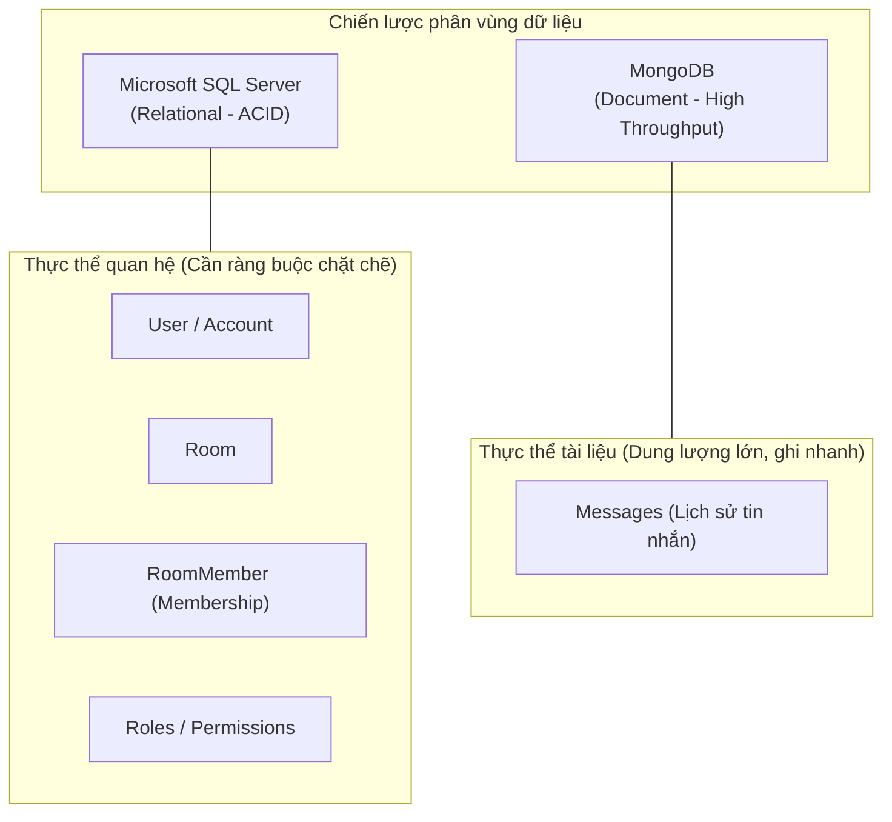
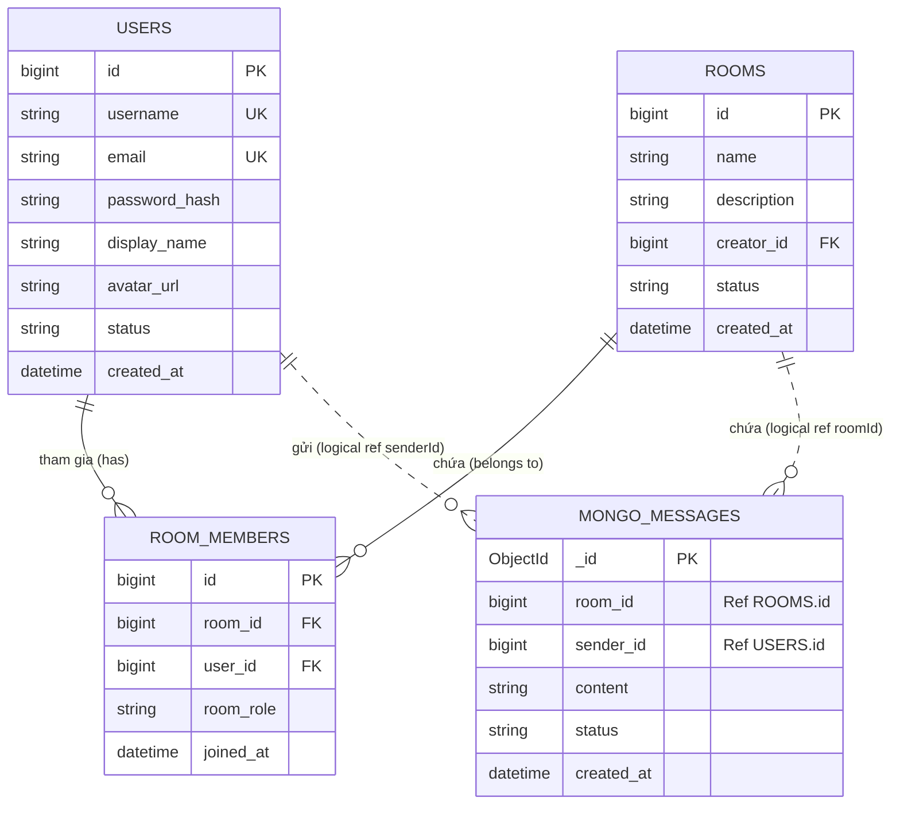

# 03 - DATABASE DESIGN: DENHUB

> **Tài liệu thiết kế cơ sở dữ liệu Hybrid (Living Documentation + Research Template)**  
> **Source of Truth** cho Schema, Quan hệ Entity, Phân vùng lưu trữ giữa SQL Server & MongoDB, Constraints và Indexes.

---

## 1. Chiến lược Database Hybrid (SQL Server + MongoDB)

Dự án DenHub sử dụng mô hình lưu trữ kết hợp (Polyglot Persistence / Hybrid Database) theo yêu cầu học phần:



### 1.1 Nguyên tắc phân vùng (`PROPOSED`)
- **Microsoft SQL Server:**  
  Chịu trách nhiệm lưu trữ các thực thể đòi hỏi tính toàn vẹn dữ liệu cao (ACID), có quan hệ nhiều-nhiều (N-N) và nghiệp vụ ràng buộc khóa ngoại (Foreign Keys):
  - Tài khoản người dùng (`User`)
  - Phòng giao tiếp (`Room`)
  - Thành viên trong phòng (`RoomMember`)
  - Vai trò và quyền hạn (`Role`, `Permission` - nếu có)
- **MongoDB:**  
  Chịu trách nhiệm lưu trữ dữ liệu có tần suất đọc/ghi cao, khối lượng lớn, cấu trúc tin nhắn có thể mở rộng:
  - Tin nhắn trao đổi (`Messages`)
  - Metadata hoặc attachments của tin nhắn (nếu có sau này)

> [!WARNING]
> **Nhắc lại nguyên tắc Scope:**
> - Tuyệt đối **KHÔNG** tạo bảng `channels` (Room quản lý trực tiếp Messages, chưa có Channel trong MVP).
> - Tuyệt đối **KHÔNG** tạo bảng `meetings`, `meeting_participants`, `meeting_schedules`.

---

## 2. Mô hình quan hệ cốt lõi (Core Domain Model)



---

## 3. Thiết kế chi tiết SQL Server (`PROPOSED / TBD`)

> [!NOTE]
> Các bảng và cột dưới đây là khung thiết kế đề xuất (`PROPOSED`). Đội ngũ phát triển cần thảo luận để chuyển thành `CONFIRMED` trước khi tạo migration/script DDL.

### 3.1 Bảng `users` (Quản lý tài khoản)
- **Mục đích:** Lưu trữ thông tin định danh và xác thực người dùng.
- **Trạng thái:** `PROPOSED`

| Cột | Kiểu dữ liệu | Ràng buộc (Constraint) | Ý nghĩa / Ghi chú |
| :--- | :--- | :--- | :--- |
| `id` | `BIGINT` | `PK`, `IDENTITY(1,1)` | Khóa chính tự tăng |
| `username` | `VARCHAR(50)` | `NOT NULL`, `UNIQUE` | Tên đăng nhập (chữ thường, không dấu) |
| `email` | `VARCHAR(100)` | `NOT NULL`, `UNIQUE` | Địa chỉ email liên hệ |
| `password_hash` | `VARCHAR(255)` | `NOT NULL` | Mật khẩu đã hash bằng BCrypt |
| `display_name` | `NVARCHAR(100)` | `NOT NULL` | Tên hiển thị người dùng |
| `avatar_url` | `VARCHAR(500)` | `NULL` | Đường dẫn ảnh đại diện |
| `system_role` | `VARCHAR(20)` | `NOT NULL`, `DEFAULT 'ROLE_USER'` | Phân quyền hệ thống (`TBD`) |
| `status` | `VARCHAR(20)` | `NOT NULL`, `DEFAULT 'ACTIVE'` | Trạng thái tài khoản (`TBD`) |
| `created_at` | `DATETIME2` | `NOT NULL`, `DEFAULT GETUTCDATE()` | Thời điểm tạo |
| `updated_at` | `DATETIME2` | `NULL` | Thời điểm cập nhật cuối |

---

### 3.2 Bảng `rooms` (Quản lý không gian giao tiếp)
- **Mục đích:** Lưu trữ thông tin các Room lâu dài của nhóm.
- **Trạng thái:** `PROPOSED`

| Cột | Kiểu dữ liệu | Ràng buộc (Constraint) | Ý nghĩa / Ghi chú |
| :--- | :--- | :--- | :--- |
| `id` | `BIGINT` | `PK`, `IDENTITY(1,1)` | Khóa chính tự tăng |
| `name` | `NVARCHAR(100)` | `NOT NULL` | Tên phòng giao tiếp |
| `description` | `NVARCHAR(500)` | `NULL` | Mô tả mục đích của Room |
| `creator_id` | `BIGINT` | `NOT NULL`, `FK -> users(id)` | Người khởi tạo phòng ban đầu |
| `status` | `VARCHAR(20)` | `NOT NULL`, `DEFAULT 'ACTIVE'` | Trạng thái phòng (`TBD`) |
| `created_at` | `DATETIME2` | `NOT NULL`, `DEFAULT GETUTCDATE()` | Thời điểm tạo |
| `updated_at` | `DATETIME2` | `NULL` | Thời điểm cập nhật cuối |

*Chỉ mục dự kiến (Indexes):*
- `IX_rooms_creator_id` trên `creator_id`
- `IX_rooms_status` trên `status`

---

### 3.3 Bảng `room_members` (Quan hệ Thành viên - Phòng)
- **Mục đích:** Bảng liên kết thể hiện mối quan hệ N-N giữa User và Room cùng với vai trò cục bộ.
- **Trạng thái:** `PROPOSED`

| Cột | Kiểu dữ liệu | Ràng buộc (Constraint) | Ý nghĩa / Ghi chú |
| :--- | :--- | :--- | :--- |
| `id` | `BIGINT` | `PK`, `IDENTITY(1,1)` | Khóa chính tự tăng |
| `room_id` | `BIGINT` | `NOT NULL`, `FK -> rooms(id)` | Tham chiếu đến Room |
| `user_id` | `BIGINT` | `NOT NULL`, `FK -> users(id)` | Tham chiếu đến User |
| `room_role` | `VARCHAR(20)` | `NOT NULL`, `DEFAULT 'MEMBER'` | Vai trò trong Room (`TBD`: OWNER, ADMIN, MEMBER) |
| `joined_at` | `DATETIME2` | `NOT NULL`, `DEFAULT GETUTCDATE()` | Thời điểm tham gia Room |

*Ràng buộc toàn vẹn & Chỉ mục:*
- `UQ_room_user`: `UNIQUE (room_id, user_id)` (Một user không thể là member 2 lần trong cùng 1 room)
- `IX_room_members_user_id`: Phục vụ truy vấn nhanh danh sách Room của một User.

---

## 4. Thiết kế chi tiết MongoDB (`PROPOSED / TBD`)

### 4.1 Collection `messages`
- **Mục đích:** Lưu trữ toàn bộ nội dung tin nhắn trao đổi trong Room.
- **Trạng thái:** `PROPOSED`

```json
{
  "_id": { "$oid": "651f8a8b1234567890abcdef" },
  "roomId": 101,
  "senderId": 15,
  "senderInfo": {
    "username": "hoangnam",
    "displayName": "Hoàng Nam",
    "avatarUrl": "https://..."
  },
  "content": "Chào cả nhà, chúng ta bắt đầu thảo luận nhé!",
  "status": "SENT",
  "createdAt": "2026-10-06T10:15:30.123Z",
  "updatedAt": null
}
```

#### Giải thích cấu trúc Document:
- `_id`: Khóa chính mặc định của MongoDB (ObjectId).
- `roomId` (`NumberLong` / `Long`): Khóa ngoại logic tham chiếu đến `rooms(id)` trong SQL Server.
- `senderId` (`NumberLong` / `Long`): Khóa ngoại logic tham chiếu đến `users(id)` trong SQL Server.
- `senderInfo` (Embedded Object - `PROPOSED`): Chứa snapshot thông tin người gửi tại thời điểm nhắn tin để giảm thiểu số lần query chéo sang SQL Server khi render danh sách tin nhắn phía client.
- `content` (`String`): Nội dung tin nhắn văn bản.
- `status` (`String`): Trạng thái tin nhắn (`SENT`, `EDITED`, `DELETED` - `TBD`).
- `createdAt` (`ISODate`): Thời điểm gửi tin nhắn.

#### Chỉ mục bắt buộc trên MongoDB (Indexes):
1. `{ roomId: 1, createdAt: -1 }`: **Compound Index cực kỳ quan trọng** để truy vấn lịch sử tin nhắn của một Room theo thứ tự thời gian phân trang (pagination) đạt tốc độ tối đa.
2. `{ senderId: 1 }`: Hỗ trợ thống kê hoặc tìm kiếm tin nhắn theo người gửi.

---

## 5. Xử lý tính toàn vẹn dữ liệu xuyên Database (Cross-Database Integrity)

Do dự án dùng Hybrid Database không hỗ trợ Distributed Transaction (2PC) trực tiếp giữa SQL Server và MongoDB, nhóm thống nhất các nguyên tắc:

1. **Khóa ngoại Logic:** MongoDB lưu `roomId` và `senderId` dưới dạng ID số nguyên tương ứng của SQL Server.
2. **Quy tắc khi Xóa dữ liệu (Delete Cascade / Soft Delete):**
   - Khi một Room bị xóa trong SQL Server: Có xóa vật lý tin nhắn trong MongoDB không? (`TBD`)  
     *Đề xuất khuyến nghị:* Áp dụng Soft Delete cho Room (`status = 'DELETED'` hoặc `'ARCHIVED'`) trong SQL Server để tránh phải thực hiện background job xóa hàng nghìn bản ghi tin nhắn trong MongoDB.
   - Khi một Member bị kick hoặc rời Room: Không xóa tin nhắn cũ của họ để giữ nguyên mạch hội thoại của nhóm.

---

## 6. Từ điển Enum / Trạng thái (`TBD Dictionary`)

| Nhóm Enum | Giá trị đề xuất | Ý nghĩa dự kiến | Trạng thái |
| :--- | :--- | :--- | :---: |
| **SystemRole** | `ROLE_USER`<br>`ROLE_ADMIN` | Người dùng tiêu chuẩn<br>Quản trị viên toàn hệ thống | `TBD` |
| **UserStatus** | `ACTIVE`<br>`INACTIVE`<br>`BANNED` | Bình thường<br>Chưa kích hoạt hoặc tạm khóa<br>Bị cấm vĩnh viễn | `TBD` |
| **RoomStatus** | `ACTIVE`<br>`ARCHIVED` | Đang hoạt động<br>Đã lưu trữ / Chỉ đọc | `TBD` |
| **RoomMemberRole** | `OWNER`<br>`ADMIN`<br>`MEMBER` | Trưởng phòng (người tạo)<br>Quản trị phòng<br>Thành viên thông thường | `TBD` |
| **MessageStatus** | `SENT`<br>`EDITED`<br>`DELETED` | Tin nhắn mới gửi<br>Đã chỉnh sửa nội dung<br>Đã bị xóa (thu hồi) | `TBD` |

---

## 7. Bảng theo dõi tiến độ thiết kế Database

| Hạng mục | Quyết định kỹ thuật | Trạng thái |
| :--- | :--- | :---: |
| Lựa chọn hệ quản trị | SQL Server (Quan hệ) + MongoDB (Tài liệu) | `CONFIRMED` |
| Thực thể User, Room, RoomMember nằm trên SQL Server | Lưu trữ quan hệ ACID | `CONFIRMED` |
| Thực thể Message nằm trên MongoDB | Tối ưu hóa throughput tin nhắn real-time | `CONFIRMED` |
| Bảng Channel | Không tạo bảng này trong MVP | `CONFIRMED` |
| Bảng Meeting / Call | Không tạo bất kỳ bảng nào liên quan | `CONFIRMED` |
| Script DDL tạo bảng SQL Server | Cần hoàn thiện script `.sql` chính thức | `TBD` |
| Script Index MongoDB | Cần cấu hình qua `@CompoundIndex` của Spring Data | `TBD` |
| Chính sách Cascade / Soft Delete | Cần team thống nhất phương án xử lý | `TBD` |
